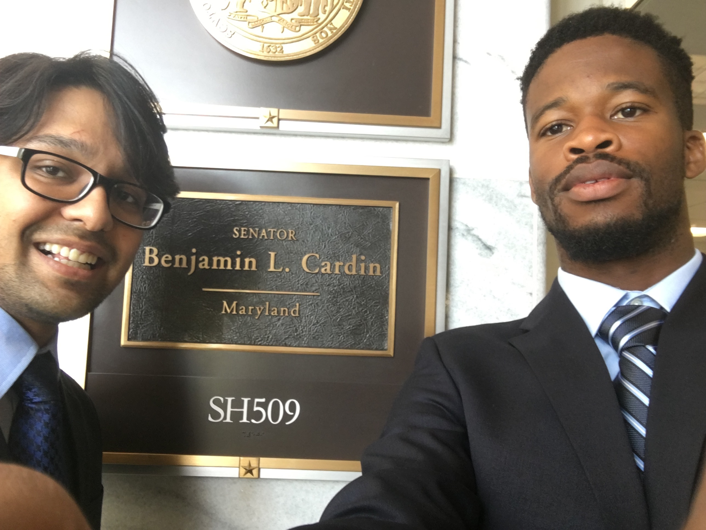
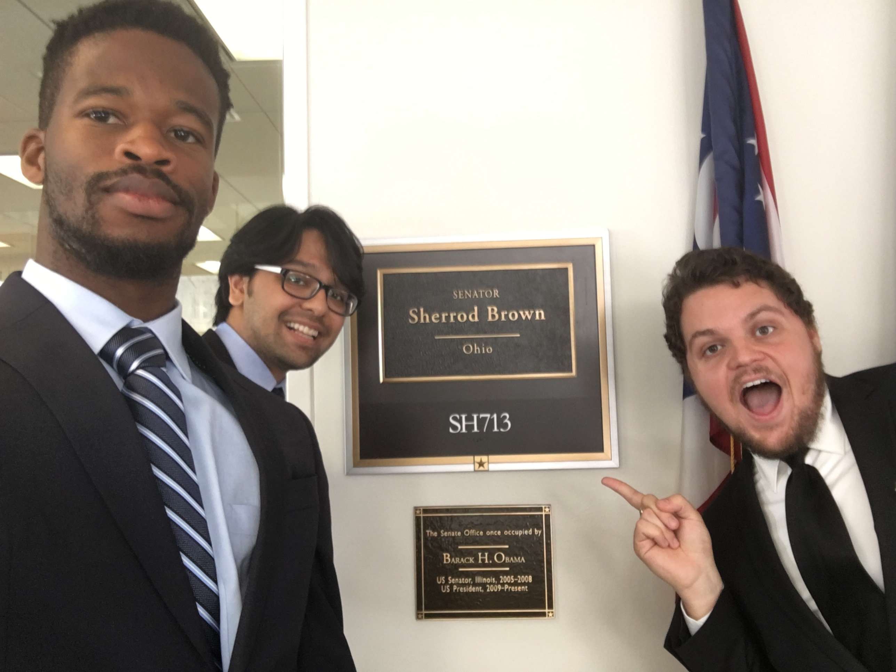
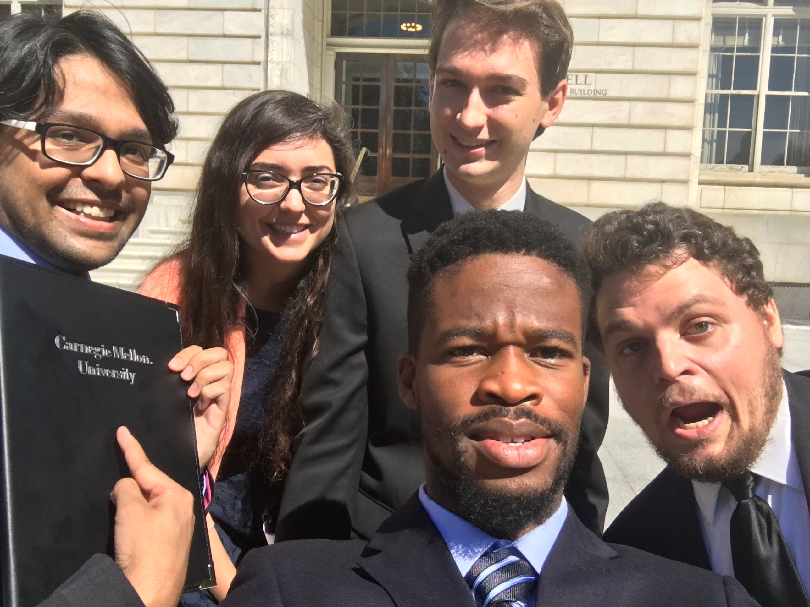

##News##

 
###*2020:*###

####**January:**#####

- Awarded the Dr. Margaret Carver Graduate Student Travel Award to attend the Gordon Research Conference & Seminar on Biology of Acute Respiratory Infections from Dept. of Biological Sciences, CMU.

 
###*2019:*###

####**December:**#####

- Accepted to give a talk at the Gordon Research Seminar on Biology of Acute Respiratory Infections to be held in February 2020. 

 
####**November:**#####

- Presented my work titled, "Function of BriC peptide in the pneumococcal competence and virulence portfolio" at the inaugural Pittsburgh Rust Belt Microbiome Conference held in Pittsburgh, PA. Awarded the poster award for my presentation.  

 
####**June:**#####

- Awarded the Glen de Vries Fellowship for AY2019-2020 from CMU Mellon College of Science. Read more information [here](https://www.cmu.edu/bio/news/2019/devries_fellowship_2019.html).

- Presented my work titled, "Cell Wall Modification Protein MurM Regulates the Stress Response Pathway in Streptococcus Pneumoniae" at the 14th European Conference on Molecular Biology of Pneumococcus held at University of Greifswald, Germany. 

 
####**May:**#####

- Awarded the CMU Outstanding Student Organization Leader Award for 2018-2019. 

 
####**April:**#####

- Accepted to give an oral talk at the 14th European Conference on Molecular Biology of Pneumococcus to be held at University of Greifswald, Germany. 

- Addressed graduate students on the 'State of Graduate Students @ CMU' on Apr 1. 

 
####**March:**#####

- Presented my work on "Function of BriC peptide in the pneumococcal competence and virulence portfolio" at Pittsburgh Bacterial Meeting held at Duquesne University, Pittsburgh, PA on Mar 9. 

- Awarded Dr. Margaret Carver Graduate Student Travel Award from Dept. of Biological Sciences, CMU.  

 
####**February:**#####

- Presented my work on "Function of BriC peptide in the pneumococcal competence and virulence portfolio" at Mid-Atlantic Microbial Pathogenesis Meeting held in Wintergreen, VA from Feb 10-12.

- Awarded travel award by the conference organizing commmittee to attend the Mid-Atlantic Microbial Pathogenesis Meeting in Wintergreen, VA.

- Attended the CMU Board of Trustee's Retreat as a student-invitee held on Feb. 22. 

- Published a science communication piece entitled "Connecting The Dots From Competence to Pneumococcal Disease" on my work in Science Trends. 

 
####**January:**#####

- My work selected for a talk at Mid-Atlantic Microbial Pathogenesis Meeting to be held in Wintergreen, VA in February.  

- Welcomed incoming graduate students at CMU's Spring Orientation, 2019! 

 
###*2018:*###

####**December:**#####

- Presented my work on "Pneumococcal guide to stress management" at Molecular Evolution Lab Discussion at University of Pittsburgh on Dec. 20.

 
####**October:**#####

- Presented my work on "Function of BriC peptide in the pneumococcal competence and virulence portfolio" at 8th ASM Conference on Biofilms held in Washington DC from Oct. 7-11, 2018.

 
####**September:**#####

- Presented my work on "Function of BriC peptide in pneumococcal competence and virulence portfolio" at TREE 2018, held at University of Pittsburgh and the CMU Department of Biological Sciences Elizabeth Jones Annual Retreat 2018. 

- My work entitled "Function of BriC peptide in the pneumococcal competence and virulence portfolio" accepted for presentation at ASM Biofilms 2018.

- Research paper accepted for publication in PLOS Pathogens! More details forthcoming. 

 
####**August:**#####

- Selected to give an oral presentation on my research at TREE 2018 to be held in September 2018 in Pittsburgh. 

- Addressed CMU's incoming graduate students during the graduate student orientation during my welcome speech, along with CMU President, Vice Provost for Education, and Vice President for Student Affairs & Dean of Students. More information can be found [here](https://www.cmu.edu/news/stories/archives/2018/august/new-students-welcomed.html) and [here](https://www.cmu.edu/bio/news/2018/graduate_student_assembly.html)

 
####**June:**#####

- Started my tenure as the President of the CMU Graduate Student Assembly for the academic year 2018-2019. 

 
####**May:**#####

- Attended the Southeastern Regional Pneumococcal Symposium at St. Jude Children's Research Hospital, Memphis from May 10-11. Gave an oral presentation on my work entitled, "The <i>Streptococcus pneumoniae </i> Competence-Induced BriC Peptide Promotes Nasopharyngeal Colonization and Impacts Biofilm Development" and a poster presentation entitled, "Revealing the Link Between Cell Wall Modification & Cellular Homeostasis in <i> S. pneumoniae </i>"

- Elected to serve as the President of the CMU Graduate Student Assembly for 2018-2019, starting June 1, 2018. 

 
####**April:**#####

- Led the CMU GSA delegation to the 2018 NAGPS Northeast Regional Conference held at University of Pennsylvania on April 20-21. 

 
####**March:**#####

- Led the CMU GSA delegation to the 2018 NAGPS Spring Legislative Action Days (LAD) held in Washington DC from March 9 - 13. The delegation had twelve meetings over the course of Mar. 12 & 13 to advocate for graduate student issues.

- Presented my research entitled "Stressed? The Pneumococcus' Guide to Stress Management" at Pittsburgh Area Microbial Pathogenesis meeting. 

 
####**February:**#####

- Awarded the MCS Graduate Student Conference Funding Award by Mellon College of Sciences, Carnegie Mellon University.

 
####**January:**#####

- Submitted my research paper on bioRxiv, the pre-print journal. 

 
###*2017:*###

####**December:**#####

- Successfully led NAGPS's (along with Samantha Hernandez, Director of Legislative Affairs, NAGPS) and CMU GSA's advocacy on the Tax Reform Bill, #ReworkTheReform. 

 
####**November:**#####

- Led the CMU GSA delegation to the 2017 NAGPS National Conference held at Syracuse University from November 2-5. 

- Awarded 2017 NAGPS Outstanding Board Member.

- Leading NAGPS’s (along with Samantha Hernandez, Director of Legislative Affairs, NAGPS) & CMU GSA’s advocacy efforts from graduate students’ perspective on the Tax Reform Bill. Covered in media such as [90.5 WESA NPR](http://wesa.fm/post/fearing-loss-tax-free-tuition-waivers-cmu-students-consider-alternatives-loans-pay-taxes#stream/0) and [The Daily Beast](https://www.thedailybeast.com/the-government-just-stomped-on-scienceright-when-we-needed-it-most).

 
####**October:**#####

- Led the CMU GSA delegation to the 2017 NAGPS Fall Legislative Action Days (LAD) held in Washington DC from September 30 - October 3. The delegation had twelve meetings over the course of Oct. 2 & 3 to advocate for graduate student issues. The delegation met with the offices of Rep. Mike Doyle [D-PA14], Sen. Pat Toomey [R-PA], Sen. Bob Casey [D-PA], Sen. Sherrod Brown [D-OH], Sen. Rob Portman [R-OH], Sen. Dick Durbin [D-IL], Sen. Tammy Duckworth [D-IL], Sen. Marco Rubio [R-FL], Sen. Bill Nelson [D-FL], Sen. Elizabeth Warren [D-MA], Sen. Ted Cruz [R-TX], and Sen. John Cornyn [R-TX]. 

- Attended the GSA Executive Committee Retreat.

 
####**September:**#####

- Helped organize the 2017 NAGPS Fall Legislative Action Days (LAD) held in Washington DC from September 30 - October 3. Some of the speakers included Clare McCann [New America], Annie Clark & Christine Fei [End Rape on Campus], Sage Carson [Know Your IX] and Delia Garcia. 

- Attended the GSA Reps Retreat.

 
####**August:**#####

- Helped welcome incoming graduate students to Carnegie Mellon, and orient them on Graduate Student Assembly, and student life in Pittsburgh.

 
####**June:**#####

- Attended the 13th European Meeting on the Molecular Biology of the Pneumococcus (Europneumo 2017). Presented my work on “Regulation and characterization of a novel, competence-responsive pneumococcal peptide implicated in biofilm development”.

- Selected to give a talk at the 13th European Meeting on the Molecular Biology of the Pneumococcus (Europneumo 2017). The meeting program can be accessed [here](http://europneumo.com/home2).

- Attended the 2017 mid-year in-person BoD meeting of National Association of Graduate-Professional Students (NAGPS) in Las Vegas, Nevada. 

 
####**May:**#####

- Elected to serve as the Vice President of External Affairs, Graduate Student Assembly, Carnegie Mellon University for the Academic Year 2017-2018. 

 
####**April:**#####

- Won the People’s Choice Award & the 2nd Place Award in the CMU Three-Minute Thesis Competition (3MT) organized by CMU Libraries. Watch the 3MT presentation [here](https://www.youtube.com/watch?v=lFzlxNOhqOQ). Read more information [here](http://www.library.cmu.edu/about/publications/news/2017-3mt-winners). 

 
####**March:**#####

- One of the ten finalists in the CMU Three-Minute Thesis Competition (3MT) organized by CMU Libraries. Read more information [here](http://www.cmu.edu/bio/news/2017/power_of_three.html).

- Helped organize the 2017 NAGPS Spring Legislative Action Days (LAD) held in Washington DC from March 11-14. Had meeting with different organizations, and Executive & Congressional offices on issues affecting graduate-professional students. 

 
####**February:**#####

- Attended the Mid-Atlantic Microbial Pathogenesis Meeting 2017, held at Wintergreen, VA. Presented my work on “Regulation & Characterization of a Novel Pneumococcal Peptide Implicated in Biofilm Development”. 

 
####**January:**#####

- Attended the 2017 National Association of Graduate-Professional Students (NAGPS) In-person Board of Directors Meeting held at University of North Texas, Denton, Texas.  

- Awarded the Stupakoff Scientific Achievement Award 2017 by CMU Department of Biological Sciences. Read more information [here](http://www.cmu.edu/bio/news/2017/stupakoff_awards.html). 

 
###*2016:*###

####**December:**#####

- Awarded the CMU GSA/Provost Conference Funding Award 2016-2017. 

 
####**November:**#####

- Attended the 2016 National Conference of the National Association of Graduate-Professional Students (NAGPS) held at Stony-Brook University. Got elected to the NAGPS Board of Directors for 2017 in the capacity of International Student Concerns Advocate. 

 
####**October:**#####

- Met with the President’s Advisory Board as a Doctoral Student Representative to deliberate about the CMU Experience & discuss ways on improving it.

 
####**September:**#####

- Attended the Elizabeth Jones Annual Department Retreat held at the Hidden Valley Resort. Had a great time talking about research being carried out in the department, welcoming the first-year students and bonding over bonfire. 

- Accepted the nomination to be a part of the University Leadership Student Advisory Council (ULSAC) & had an enlightening first meeting chaired by Provost Jahanian.

- Part of the CMU delegation that travelled to Washington DC to participate in Fall Legislative Action Days, to advocate on the behalf of graduate students nationwide. Met with the offices of Sen. Toomey [R-PA], Sen. Casey [D-PA], Sen. Brown [D-OH] and Sen. Cardin [D-MD].  

 
####**April:**####

- Attended the 2016 Northeast Regional Conference of the National Association of Graduate-Professional Students (NAGPS) held at Stony-Brook University. Got elected the Director of Legislative Affairs for the region, and subsequently, to serve on the National Legislative Concerns Committee.  

- Presented the work done at CMU on convening and the workings of the International Graduate Students Task Force at the 2016 Regional NAGPS Conference.

 
####**March:**####

- Was at the City Council with other graduate students from across the city, to receive the City of Pittsburgh Proclamation declaring April 3-9 as the Graduate & Professional Student Appreciation Week in the city of Pittsburgh. 

- Spoke with numerous international graduate students across the University during coffee breaks organized by the International Graduate Student Task Force to understand the key issues faced, and the related priorities. 

 
####**February:**####

- Passed my thesis proposal. Officially, a PhD Candidate in the [Hiller Lab](https://www.bio.cmu.edu/labs/hiller/index.html). 

 
###*2015:*###

####**November:**#####

- Presented the preliminary plan for my thesis proposal to my research advisory committee. Now to writing the thesis proposal for the defense early next year. 